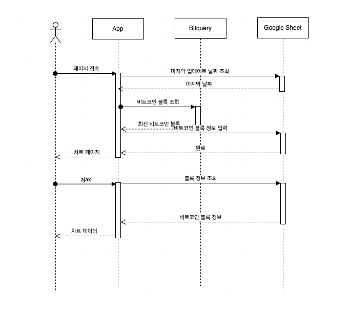

# 비트코인 차트

## 페이지 연동 및 구성

1. 페이지 접근시 서비스는 구글 시트에서 마지막 업데이트된 블록 정보를 가져온다.
2. 마지막 업데이트된 날짜 이후의 데이터를 bitquery에서 가지고 온다. 
3. bitquery에서 가지고 온 블록 정보를 구글스프레드 시트에 기록한다.
4. 차트 페이지를 로딩한다. 
5. 페이지에서 차트 정보를 불러온다. 
6. 구글스프레드 시트에서 차트에 필요한 데이터를 가지고 온다. 
7. 차트를 그린다.

## 구글 스프레드 시트
* [구글 스프레드시트](https://docs.google.com/spreadsheets/d/10aVcAx5QWv5rjNJELfjawJwAVEvBypYhyJSD9hpsv0A/edit#gid=0)
